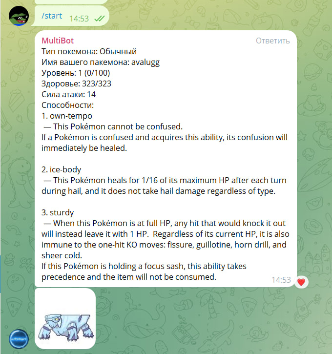
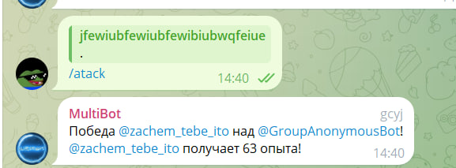
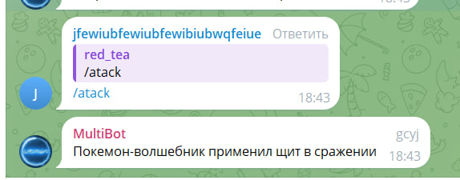
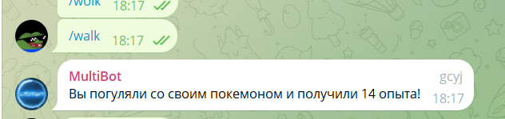
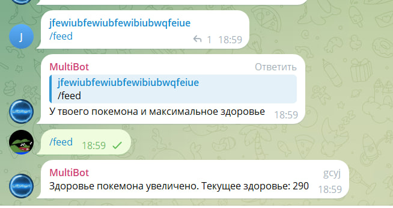

# MultiBot: Создавайте, гуляйте и сражайтесь со своими собственными покемонами!
Данный проект представляет собой Telegram-бота, который позволяет пользователям создавать своих собственных покемонов, проводить с ними время на прогулках, кормить и даже сражаться с другими покемонами.

### **Основные возможности:**
- Создание персональных покемонов с уникальными характеристиками.
- Прогулки с покемонами для повышения их уровня.
- Возможность кормить своих покемонов.
- Экспериментирование с видами сражений между покемонами.

### **Функции:**
- Повышение опыта возможно через победу над покемонов другого пользователя. Так же за прогулку тоже дают опыт.
- Повышение уровня повышает максимальное здоровье и силу атаки. Так же востанавливает здоровье до максимального.
- Востановление здоровье происходит через кормление покемона.

### **Команды:**
- `/start` - создание покемона.
- `/pokemon` - информация о покемоне.
- `/feed` - покормить покемона.
- `/walk` - погулять с покемоном.
- `/atack` - атаковать другого покемона.

### **Скриншоты:**

   

   

### **Вклад в проект:**
Ваши предложения и исправления всегда приветствуются! Если у вас есть идеи по улучшению проекта, не стесняйтесь создать запрос на изменение (Pull Request).
